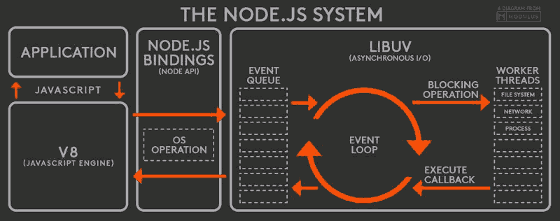

# 面试题系列之事件循环(EventLoop)

## 面试题

1. 描述事件循环，宏任务、微任务分别是什么？
2. 代码输出题

```js
console.log(1);
setTimeout(() => {
  console.log(2);
  Promise.resolve().then(() => {
    console.log(3)
  });
});

new Promise((resolve, reject) => {
  console.log(4)
  resolve(5)
}).then((data) => {
  console.log(data);
  
  Promise.resolve().then(() => {
    console.log(6)
  }).then(() => {
    console.log(7)
    
    setTimeout(() => {
      console.log(8)
    }, 0);
  });
})

setTimeout(() => {
  console.log(9);
})

console.log(10);
```


```js
async function async1() {
	console.log("1async1 start");
	await async2(); 
	console.log("5async1 end");
}
async function async2() {
	console.log("2async2");
}
async1();
new Promise(function (resolve) {
	console.log("3promise1");
	resolve();
}).then(function () {
	console.log("6promise2");
});
console.log("4script end");

```


## 基本概念

**前置知识**
1. 进程与线程
2. 浏览器多进程（浏览器主进程、渲染进程、网络进程、GPU进程、插件进程）
3. 渲染进程（GUI渲染线程、JS引擎线程、事件触发线程、定时器触发线程、异步HTTP请求线程、IO线程）


## 宏任务&微任务

- 宏任务：script, ajax, 事件, requestFrameAnimation, setTimeout, setInterval
- 微任务：promise.then, MutationObserver, process.nextTick(Node)


## 浏览器中的EventLoop（事件触发线程）


1. 先走执行栈里面的代码，遇到`宏任务``微任务`推送至相应队列（定时器等时间到了才会推入执行队列）
2. 当前执行栈代码结束后，在去执行`微任务`队列中的代码
3. 执行`微任务`完毕后，进行`GUI渲染`
4. 宏任务队列中取出进行执行

> 微任务&宏任务内同步代码里面也会包含微任务和宏任务也是推送至相应队列 进行执行

## Node中的EventLoop

`libuv`负责NodeAPI的执行，将不同的任务分配给不同的线程，形成一个EventLoop




### 思考题

执行结果并标注时间

```js
function sleep(waiting) {
  let t = Date.now()
  while(t + waiting > Date.now()) {}
}

let p = new Promise((resolve, reject) => {
  console.log('1')
  resolve(2)
})

p.then(res => {
  sleep(10000)
  console.log(res)
})
setTimeout(() => {
  console.log(3);
}, 1000)
```