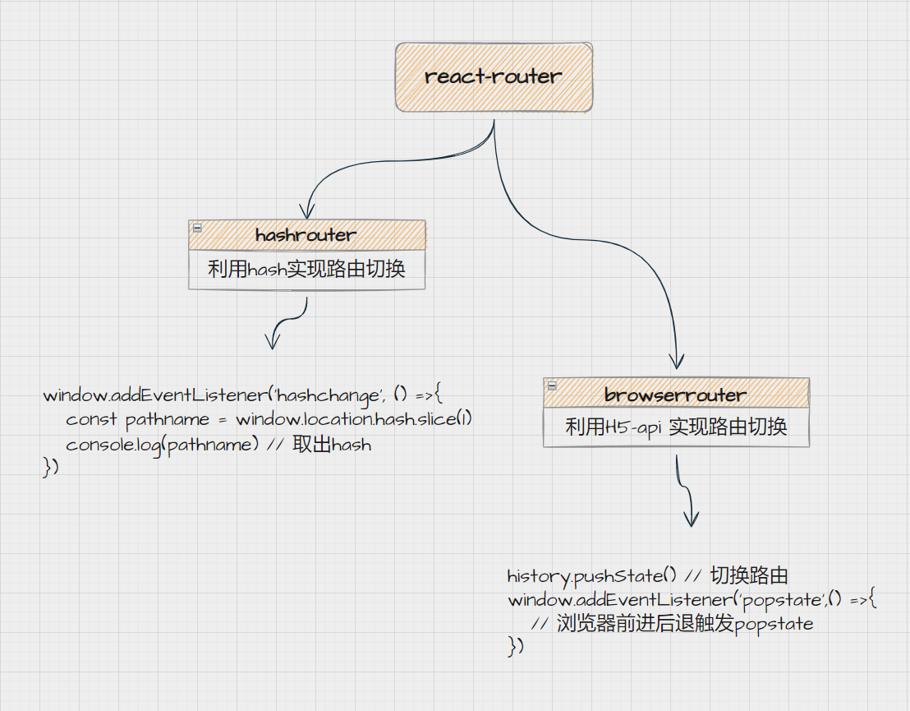

# react-router

## 路由基本原理



HashRouter: 改变地址栏`url`上的`hash`值，监听[`hashChange`](https://developer.mozilla.org/zh-CN/docs/Web/API/Window/hashchange_event)实现路由跳转
BrowserRouter：通过`HTML5`API[`history`](https://developer.mozilla.org/zh-CN/docs/Web/API/History)实现路由跳转


### HashRouter

```js
window.addEventListener('hashchange', () => {
  const hash = window.location.hash.slice(1)
  console.log(hash)
})
```

### BrowserRouter

路由路径没有#号，当浏览器刷新页面后，会将url发送至服务端，因此需要服务把路由重定向到跟页面。

history：
  - `history.pushState()`: 按指定的名称和 URL 将数据 push 进会话历史栈。
  - `history.replaceState()`: 按指定的数据，名称和 URL(如果提供该参数)，替换当前历史栈中的记录。
  - `history.forward()`: 在浏览器历史记录里前往下一页，用户可点击浏览器左上角的前进 (→) 按钮模拟此方法。
  - `history.back()`: 在浏览器历史记录里前往上一页，用户可点击浏览器左上角的返回 (←) 按钮模拟此方法。
  - `history.go()`: 通过当前页面的相对位置从浏览器历史记录 ( 会话记录 ) 加载页面。
  - `window.onpopstate`：只会在浏览器某些行为下触发，比如点击后退按钮（或者在 JavaScript 中调用 history.back() 方法）

由于`onpopstate`事件只能在特定条件下触发，所以需要对pushState进行重写（AOP）

```js
<body>
  <div onclick="a()">push -> /a</div>
  <div onclick="b()">push ->  /b</div>
  <div onclick="go()">go  -1 </div>
  <hr>
  跳转页面=>
  <div id="text"></div>
  <script>
    const history = window.history
    let oldHistory = history.pushState

    history.pushState = (data, unused, url) =>{
      alert(url)
      oldHistory.apply(history, [data, unused, url])

      TextDOM.innerHTML = window.location.pathname
    }

    const TextDOM = document.querySelector('#text')
    function a() {
      history.pushState('a', null, '/a')
    }

    function b() {
      history.pushState('b', null, '/b')
    }

    function go() {
      history.go(-1)
    }
    
    window.onpopstate = (e) => {
      console.log('浏览器回退');
      TextDOM.innerHTML = window.location.pathname
    }

  </script>
</body>
```


### 相关问题

1. Router两种模式的区别以及实现原理

> hash模式 路径带#号 利用hashchange实现
> browser模式 路径没有#号 利用history实现

2. 在history模式中push和replace有什么区别？

> push是新增会话栈头部，replace是替换会话栈上的数据