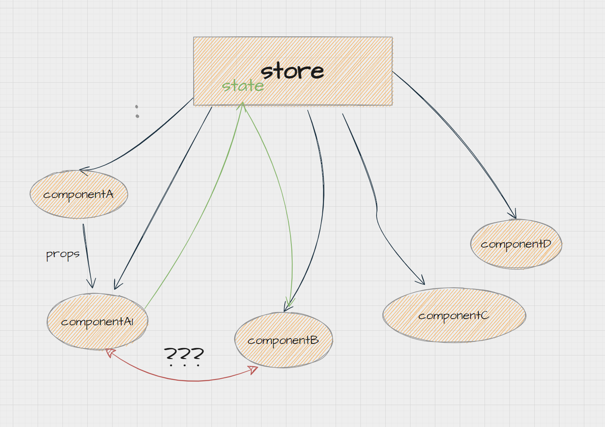

# redux

作用：存储全局状态，方便组件之间通信


## 基本原理

设计模式：发布订阅者模式（观察者模式）

建立 store 存储状态，暴露 dispatch 方法，外部可以通过 dispatch 进行修改数据，外部可以订阅 store 中的状态。

```js
const store = (initState = {}) => {
	let state = initState;
	let listeners = [];
	const subscribe = (fn) => {
		listeners.push(fn);
	};
	const getState = () => state;
	const dispatch = (payload) => {
		state = {
			...state,
			...payload,
		};
		listeners.forEach((l) => l());
	};
	return {
		getState,
		subscribe,
		dispatch,
	};
};

let { getState, subscribe, dispatch } = store({ name: "diqiu", age: 18 });
// 订阅
subscribe(() => {
	console.log(getState());
});

// 发布
dispatch({ age: 19 });

setTimeout(() => {
	// 发布
	dispatch({ age: 20 });
}, 1000);
```

### createStore


作用：创建`store`返回`getState、dispatch、subscribe`方法
[示例](https://www.redux.org.cn/docs/api/createStore.html)


```js
const createStore = (reducer, initState = {}) => {
	let state = initState;
	let listeners = [];
	function getState() {
		return state;
	}
	function dispatch(action) {
		state = reducer(state, action);
		listeners.forEach((l) => l());
		return action;
	}
	function subscribe(listener) {
		listeners.push(listener);
		return () => {
			listeners = listeners.filter((l) => l !== listener);
		};
	}
	dispatch({ type: "@@REDUX/INIT" });
	return {
		getState,
		dispatch,
		subscribe,
	};
};
export default createStore;
```

### bindActionCreators

作用：简化调用过程
[示例](https://www.redux.org.cn/docs/api/bindActionCreators.html)

```js
function bindActionCreator(actionCreator, dispatch) {
	return (...args) => {
		return dispatch(actionCreator.apply(null, args));
	};
}

function bindActionCreators(actionCreators, dispatch) {
	const boundActionCreators = {};
	for (const key in actionCreators) {
		const actionCreator = actionCreators[key];
		boundActionCreators[key] = bindActionCreator(actionCreator, dispatch);
	}
	return boundActionCreators;
}

export default bindActionCreators;
```

### combineReducers

作用：合并多个 reducer
[示例](https://www.redux.org.cn/docs/api/combineReducers.html)

```js
function combineReducers(reducers) {
	return function combination(state = {}, action) {
		let nextState = {};
		for (const key in reducers) {
			let prevStateForKey = state[key];
			let reducersForKey = reducers[key];
			let nextStateForKey = reducersForKey(prevStateForKey, action);
			nextState[key] = nextStateForKey;
		}
		return nextState;
	};
}

export default combineReducers;
```

根据组件拆分不同的`reducer`各自维护相应状态, 将`reducerA、reducerB、reducerC`合并成一个大`reducer`。

```js
// 返回 state {number: 0}
const reducerA = (state, action) => {
	switch (action.type) {
	}
};
// 返回 state {number: 0}
const reducerB = (state, action) => {
	switch (action.type) {
	}
};
// 返回 state {number: 0}
const reducerC = (state, action) => {
	switch (action.type) {
	}
};
// 返回 {a: {number: 0}, b: {number: 0}, c:{number:0}}
const reducer = combineReducers({
	a: reducerA,
	b: reducerB,
	c: reducerC,
});
```

### applyMiddleware

作用：使用包含自定义功能的 middleware 来扩展 Redux 是一种推荐的方式。
[示例](https://www.redux.org.cn/docs/api/applyMiddleware.html)

```js
function compose(...funcs) {
	return funcs.reduce(
		(a, b) =>
			(...args) =>
				a(b(...args))
	);
}
function applyMiddleware(...middlewares) {
	return function (createStore) {
		return function (reducer, preloadedState) {
			let store = createStore(reducer, preloadedState);
			let dispatch;
			let middlewareAPI = {
				getState: store.getState,
				dispatch: (action) => dispatch(action),
			};
			let chain = middlewares.map((middleware) => middleware(middlewareAPI));
			dispatch = compose(...chain)(store.dispatch);
			return {
				...store,
				dispatch,
			};
		};
	};
}
export default applyMiddleware;
```

## 相关问题

1. 谈一下 redux 的理解，其工作原理？

> redux 相当于一个全局变量，把共享数据放到这个变量上，方便组件之间的通信
> 工作原理使用发布订阅模式，当改变 state 时，会调用监听函数告诉订阅者，state 改变了

2. Redux 遵循的三个原则？

> 单一数据源 store
> state 只读的，唯一改变 state 的方法就是 action
> 纯函数来执行修改 reducer

3. 数据如何通过 redux 流动?

> 视图层调用 dispatch 触发 action 改变 store 中的 state 的值 视图层监听数据变化后，拿到最新的值

4. react-redux 的两个主要功能

> provider store 存入 Context 中
> connect 从 Context 中取出并根据参数获取相应 state 和 dispatch 作为组件的 props

5. redux 中的异步请求怎么处理

> 使用 redux-promise redux-saga

6. 介绍 redux 中间件

> 中间件可以改变数据流，在 dispatch 和 reducer 之间执行
