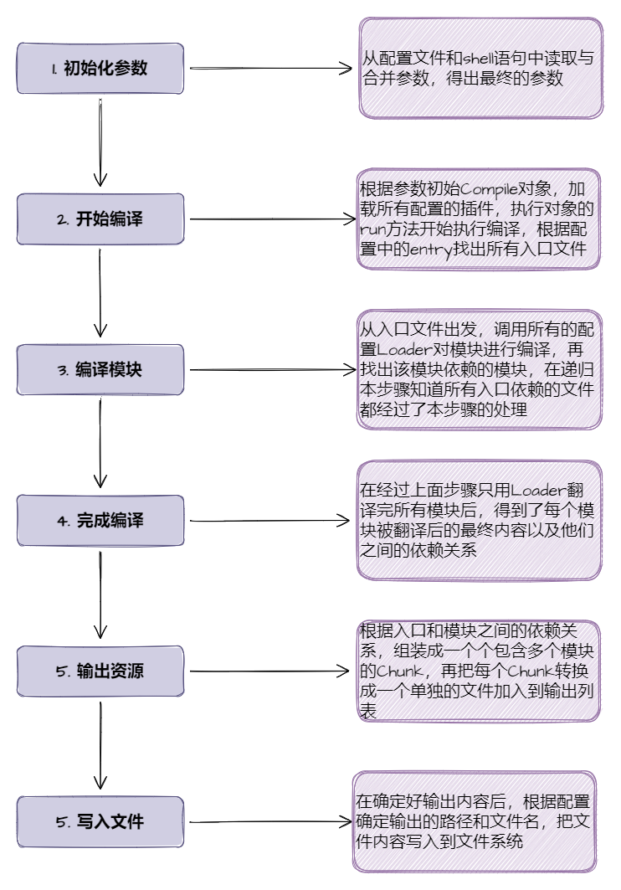

# webpack

## 相关问题

- webpack 原理/构建流程是怎么样的
- loader 的作用，执行顺序，如何实现？说下常用的 loader
- plugin 的作用，如何实现？说下常用的 plugin
- webpack 热更新原理
- webpack 性能优化
- webpack 缓存 hard-source-webpack-plugin 和 cache-loader 区别以及实现？
- 描述一下抽象语法树，babel的作用？
- source map是什么？生产环境怎么用？

## webpack 原理（构建流程）

**原理（构建流程）**

1. 读取配置文件和`shell`语句中的参数，进行合并。得到初始化参数。
2. 开始初始化`Compiler`对象，调用配置项里面插件的`apply`方法，挂载监听。
3. 根据`entry`配置的入口文件，调用配置项的`loader`对模块进行编译，并找出所依赖的模块，进行递归编译查找依赖。
4. 经过`loader`编译后，得到编译后的内容以及依赖关系，组装成一个个包含多个模块的`chunk`，在把每个`chunk`转换成一个单独的文件加载到输出列表
5. 根据配置确定输出的路径和文件名，把文件内容写入到文件系统

> 以上就是 webpack 基本原理（构建流程）。



## loader 加载器

作用：webpack 基于 node 直接识别 js 模块，引入其他类型文件需要 loader 进行编译转换。

执行顺序：**链式传递**，按照配置项的相反顺序执行（倒序）

实现：loader 本身是个函数，接收源代码，返回处理过的代码

```js
// babel-loader
function loader(source) {
	// 先对源代码转换成抽象语法树 babylon
	// 对抽象语法树进行转换得到新AST traverse
	// 新的AST转换语法树 preset-env
	let code = transform(source);
	return code;
}
module.exports = loader;
```

**常用的 loader:**

1. 处理样式相关 style-loader css-loader postcss-loader less-code sass-loader
2. 处理 js/jsx 相关：babel-loader eslint-loader
3. 处理 ts 相关: ts-loader

## plugin 插件

作用：监听 webpack 提供的事件钩子，在相应的时间点对打包内容进行修改。

实现：插件是一个类，类有一个`apply`方法，`apply`的参数是`compiler`

```js
class Plugin {
	// 通过 compiler 上提供的 Api，可以对事件进行监听，执行相应的操作
	apply(compiler) {}
}
```

事件流机制：将各个插件串联起来，实现的核心就是`Tapable`，基于观察者模式。`webpack` 中最核心的负责编译的 `Compiler` 和负责创建 bundle 的 `Compilation` 都是 `Tapable` 的实例.

**Compiler**：webpack 的环境配置。包含所有的配置信息，如 options、loader、plugin 等信息。

**Compilation**：当监听文件变化时，会创建出一个 Compilation 对象，开始新的编译。对象包含当前模块的资源、编译输出资源、变化的文件，已经跟踪依赖的状态信息。还提供了`api`，可以进行监听事件

**常用的 plugin**

- html-webpack-plugin 加载 html，引入 css、js 文件
- terser-webpack-plugin 压缩 js
- DefinePlugin 定义全局变量
- optimize-css-assets-webpack-plugin 优化压缩 css
- mini-css-extract-plugin 提取 css

## webpack 热更新原理

作用：对代码进行修改并保存后，webpack 会对代码进行打包，并将新的模块发送到浏览器端，浏览器用新的模块替换掉旧的模块，以实现不刷新浏览器的提前下更新页面。

原理：

1. 使用 webpack-dev-server 托管静态资源，同时以 runtime 方式注入客户端代码。
2. 浏览器加载页面后，与 wds 建立 websocket 链接
3. webpack 监听文件变化后，增量构建发送变更的模块，并通过 websocket 发送 hash 事件
4. 浏览器接收到 hash 事件后，请求 manifest 资源文件，确认增量变更范围
5. 浏览器加载发生变更的增量模块
6. webpack 运行触发变更模块的 module.hot.accept 回调，执行代码变更逻辑

https://zhuanlan.zhihu.com/p/30669007
https://github.com/careteenL/webpack-hmr


webpack 可以将不同的模块打包成 bundle 文件或者几个 chunk 文件，但是当我通过 webpack HMR 进行开发的过程中，我并没有在我的 dist 目录中找到 webpack 打包好的文件，它们去哪呢？

通过查看 webpack-dev-server 的 package.json 文件，我们知道其依赖于 webpack-dev-middleware 库，那么 webpack-dev-middleware 在 HMR 过程中扮演什么角色？

使用 HMR 的过程中，通过 Chrome 开发者工具我知道浏览器是通过 websocket 和 webpack-dev-server 进行通信的，但是 websocket 的 message 中并没有发现新模块代码。打包后的新模块又是通过什么方式发送到浏览器端的呢？为什么新的模块不通过 websocket 随消息一起发送到浏览器端呢？

浏览器拿到最新的模块代码，HMR 又是怎么将老的模块替换成新的模块，在替换的过程中怎样处理模块之间的依赖关系？

当模块的热替换过程中，如果替换模块失败，有什么回退机制吗？

1. webpack监听文件变化，从新进行编译打包，存在内存当中
2. 通过webpack-dev-server和webpack之间的接口交互


## webpack 性能优化

### 1. 代码优化

#### 1.1 代码压缩
 
1. js压缩  terser-webpack-plugin
2. css提取压缩 


#### 1.2 代码分割 

1. 入口文件分割

```js
{
  entry: {
    main: "./src/index.js",
    other: "./src/other.js"
  }
}
```

2. 动态导入和懒加载

动态导入：业务组件内根据逻辑去加载模块

**index.js**
```js
// click...
// if ...
import('./dynamic').then(res => {
  console.log(res.default);
})
```

路由懒加载：

```js
import React, { lazy} from "react"
import Home from '../page/Home'
const Profile = lazy(() => import('../page/Profile.js'))

const routes = [
  { path: '/', element: <Home /> },
  { path: '/profile', element: <Profile /> },
  { path: '*', element: <NotFound /> }
]
export default routes

<Suspense fallback={'loading'}>
  <Router />
</Suspense>
```


3. 代码分割

作用：提取公共代码为单独文件进行加载，减少加载成本，提升用户体验
实现：将 [optimization.runtimeChunk](https://webpack.js.org/configuration/optimization/#optimizationruntimechunk) 设置为 `true` 或 `multiple` 会向每个入口点添加一个仅包含运行时的附加块。

#### 1.3 Scope Hoisting

**作用域提升**，将分散的模块划分到同一个作用域中，避免了代码的重复引入，有效减少打包后的代码体积和运行时的内存损耗

#### 1.4 Tree-shaking

作用：把用到方法打入bundle，没用到的方法会uglify阶段擦除掉
原理：是利用es6模块的特点，只能作为模块顶层语句出现，import的模块名只能是字符串常量

开启：webpack默认支持，在`.babelrc`里设置`module:false`即可在`production mode`下默认开启

### 2. 编译性能优化

**2.1 费时分析**

使用[speed-measure-webpack-plugin](https://github.com/stephencookdev/speed-measure-webpack-plugin)插件查看编译过程时长


**2.2 缩小查找文件范围**

**resolve.extensions**: 指定`extension`之后可以不用在`require`或是`import`的时候加文件扩展名,会依次尝试添加扩展名进行匹配

**resolve.alias**: 配置别名可以加快`webpack`查找模块的速度

**resolve.modules**: 对于直接声明依赖名的模块（如`react`），`webpack` 会类似`Node.js`一样进行路径搜索，搜索`node_modules`目录

**module.noParse**：用于配置哪些模块文件的内容不需要进行解析

**IgnorePlugin**：用于忽略某些特定的模块，让`webpack`不把这些指定的模块打包进去


**2.3 缓存配置**

**babel-loader**: 开启缓存`options.cacheDirectory: true`
**cache-loader**: 在一些性能开销较大的 `loader` 之前添加此 `loader`,以将结果缓存到磁盘里, 存和读取这些缓存文件会有一些时间开销,所以请只对性能开销较大的 `loader` 使用此 `loader`
**hard-source-webpack-plugin**: 为模块提供了中间缓存,缓存默认的存放路径是`node_modules/.cache/hard-source`

**2.4 多进程处理**

1. [thread-loader](https://github.com/webpack-contrib/thread-loader)

2. terser-webpack-plugin 开启 parallel 参数

## webpack 缓存 hard-source-webpack-plugin 和 cache-loader 区别以及实现

**hard-source-webpack-plugin**

长效缓存是浏览器层面的缓存，Webpack经过optimization的splitChunks和runtimeChunk的配置，让编译输出的文件具备稳定的hash名称，从而让浏览器能长期有效、安全的复用缓存，达到加速页面加载的效果。数据库

编译缓存是编译时的缓存，Webpack经过在首次编译后把结果缓存起来，在后续编译时复用缓存，从而达到加速编译的效果

**cache-loader**

针对babel-loader处理的进行缓存

Webpack5直接从内部核心代码的层面，统一了持久化缓存的方案，有效下降了缓存配置的复杂性。除此以外，因为全部被webpack处理的模块都会被缓存，咱们npm run start/build的二次编译速度会远超cache-loader，同时dll也能够退出历史舞台了。

Webpack4时之因此要有dll，是由于cache-loader并不能覆盖全部模块，只能对个别被loader处理的模块进行缓存。而那些通用的库是无法被cache-loader处理的，因此只能经过dll的方式来预编译。


Webpack5的内置缓存方案不管从性能上仍是安全性上都要好于cache-loader：

性能上：因为因此被webpack处理的模块都会被缓存，缓存的覆盖率要高的多

安全上：因为cache-loader使用了基于mtime的缓存验证机制，致使在CI环境中缓存常常会失效，可是Webpack5改用了基于文件内容etag的缓存验证机制，解决了这个问题


## 描述一下抽象语法树，babel的作用？

**抽象语法树**
概念：对源代码语法结构的一种抽象表示。树状的形式表现编程语言的语法结构，树上每个节点都表示源代码中的一种结构

用途：代码语法、风格的检查，代码的格式化高亮等等。

`JavaScript Parser`是把JavaScript源码转化为抽象语法树的解析器

**babel**

作用：转码es6+的代码，使其在旧的浏览器环境也能运行
过程：
  - Parse 解析：将源代码转换成抽象语法树，
  - Transform 转换：对抽象语法树进行转换
  - Generate 代码生成：对转换过得抽象语法树生成新的代码

## source map是什么？生产环境怎么用？

作用：讲编译、打包压缩后的代码映射到源代码的过程。

map文件只要不打开开发者工具，就不会进行加载。

生产环境配置：
  - `hidden-source-map`：借助第三方错误监控平台 Sentry 使用
  - `nosources-source-map`：只会显示具体行数以及查看源代码的错误栈。安全性比 sourcemap 高
  - `sourcemap`：通过 nginx 设置将 .map 文件只对白名单开放(公司内网)
